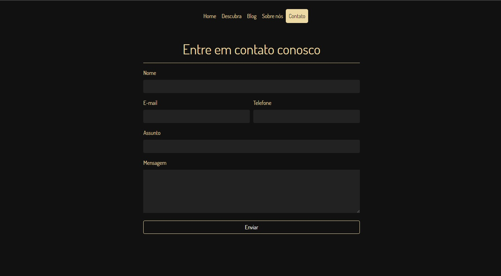
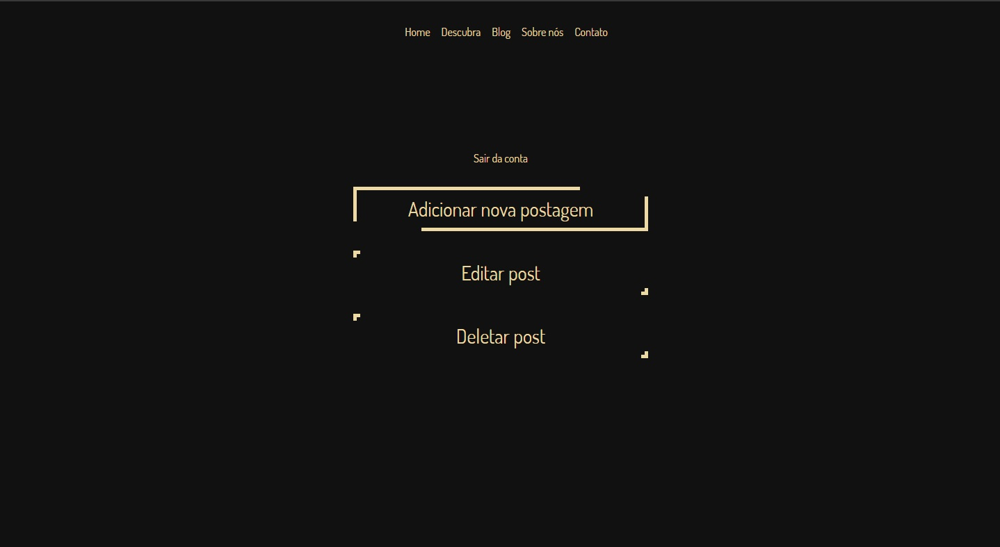

# BOOKSTAN
### O PROJETO
 Bookstan é um projeto desenvolvido com o objetivo de oferecer um script que recomenda ao usuário um
 novo livro para começar a leitura a partir de requisitos pré-estabelecidos.
 
### FEATURES

- Engine de busca por livros baseado em pontuação por similaridade.
- Blog.
- Controle de blog via dashboard.
- Banco de dados com dezenas de livros trabalhados.
- Página de contato funcional.
- Autentificação de usuário.
- Sistema de Rotas.
- Projeto desenvolvido em MVC.
- Paginação.
- Inserção do disqus ao blog.
e muito mais.

### ALGUMAS SCREENSHOTS

